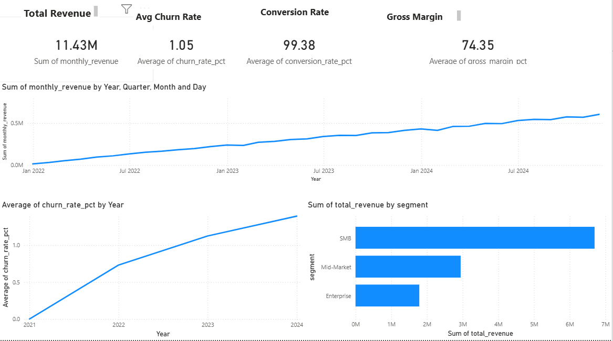

# SaaS KPI Dashboard

End-to-end SaaS analytics pipeline: synthetic data generation → PostgreSQL → dbt dimensional model (staging + mart layers with 20+ automated tests) → Power BI executive dashboard. Tracks revenue, churn, gross margin, and LTV across 10,000 customers and 36 months.

> **Key finding:** SMB drives 61% of revenue ($6.7M) while carrying the highest churn risk — reducing SMB churn by 3% annually retains ~$200K ARR.



## Tech Stack

| Layer | Technology |
|---|---|
| Data Generation | Python, Faker — 10K customers, 36 months, realistic churn + payment simulation |
| Database | PostgreSQL — indexed schema, FK constraints |
| Transformation | dbt — staging views + mart tables, 20+ schema tests, source freshness checks |
| SQL Lint | sqlfluff — enforces PostgreSQL dialect formatting |
| Dashboard | Power BI — executive overview with KPI tiles, trend charts, segment breakdown |
| CI/CD | GitHub Actions — Postgres container, `dbt run` + `dbt test` on every push |

## dbt Project Structure

```
dbt/
├── models/
│   ├── staging/                    ← views on raw tables (type casting, normalization)
│   │   ├── stg_customers.sql       ← segment lowercase, tenure_years derived
│   │   ├── stg_subscriptions.sql   ← is_active flag, duration_days
│   │   ├── stg_payments.sql        ← is_successful flag, payment_month partition
│   │   └── stg_costs.sql           ← total_cost derived column
│   └── marts/                      ← materialized tables consumed by Power BI
│       ├── fct_monthly_revenue.sql ← MoM growth %, cumulative revenue
│       ├── fct_churn_metrics.sql   ← churn rate with delta tracking
│       ├── fct_gross_margin.sql    ← revenue vs cost, margin %
│       └── dim_customers.sql       ← LTV tier, current plan, payment history
├── models/staging/schema.yml       ← source tests: unique, not_null, accepted_values, FK
├── models/marts/schema.yml         ← mart tests: expression checks, accepted_values
└── dbt_project.yml
```

**dbt Data Quality Tests (20+):**
- `unique` + `not_null` on all primary keys
- `accepted_values` on segment, plan_type, payment_status, ltv_tier
- FK relationship checks (subscriptions → customers)
- Expression tests: `monthly_price >= 0`, `amount > 0`, `churn_rate_pct BETWEEN 0 AND 100`

## Quick Start

```bash
git clone https://github.com/pulipakav1/kpi_dashboard.git
cd kpi_dashboard-main

pip install -r requirements.txt
python generate_saas_data.py          # generates customers.csv, subscriptions.csv, payments.csv, costs.csv

# Load into PostgreSQL
psql -U postgres -d saas_analytics -f db_setup.sql

# Run dbt
cd dbt
cp profiles.yml.example ~/.dbt/profiles.yml   # edit DB creds
dbt deps
dbt run
dbt test
```

## Simulated Dataset

| Table | Rows | Description |
|---|---|---|
| customers | 10,000 | Signup date, segment (SMB/Mid-Market/Enterprise), country, channel |
| subscriptions | 10,000 | Plan type, monthly price, churn date if applicable |
| payments | ~168,000 | Monthly payments, 95% success rate |
| costs | 36 | Monthly infra + marketing + support costs |

**Churn rates by segment:** SMB 25% · Mid-Market 15% · Enterprise 7%

## Business Results (36-month summary)

| Metric | Value |
|---|---|
| Total Revenue | $11.43M |
| Avg Monthly Churn | 1.05% (~12.6% annualized) |
| Avg Gross Margin | 93–94% |
| Paying Customers (Dec 2024) | 8,066 |
| MoM Revenue Growth (Dec 2024) | +6.0% |

### Revenue by Segment

| Segment | Revenue | Customers | Avg LTV |
|---|---|---|---|
| SMB | $6.7M (61%) | 6,020 | $1,112 |
| Mid-Market | $2.9M (26%) | 2,450 | $1,202 |
| Enterprise | $1.8M (16%) | 1,472 | $1,214 |

## SQL Modules

| File | What it computes |
|---|---|
| `kpi.sql` | Monthly revenue, churn rate, conversion, MoM/YoY growth, LTV |
| `forecast.sql` | 3–6 month revenue projections (moving average, linear, seasonal) |
| `anomaly_detection.sql` | Flags months with >10–15% MoM revenue changes or churn spikes |

## Forecast Validation

`scripts/forecast_validation.py` runs walk-forward backtesting across all three forecast methods:

- Trains on months 1–24, evaluates rolling 3-month horizons
- Reports **MAPE** and **RMSE** per method across all folds
- Identifies the best-performing method with quantified accuracy
- Output: `reports/forecast_validation.png`

```bash
python scripts/forecast_validation.py
```

## CI/CD

GitHub Actions (`.github/workflows/ci.yml`) on every push:

1. **Spin up Postgres 15** container via service container
2. **Seed data** — run `generate_saas_data.py` + `db_setup.sql`
3. **dbt compile → dbt run → dbt test** — full model + test suite
4. **sqlfluff** — SQL dialect linting on all dbt models
5. **ruff** — Python linting on generator script

## Dashboard Highlights

Power BI executive dashboard (`reports/dashboard_page1.png`):

- 4 KPI tiles: Total Revenue · Avg Churn Rate · Conversion Rate · Gross Margin
- Monthly Revenue Trend (36-month line chart)
- Monthly Churn Rate trend
- Revenue by Segment (stacked bar)
- Gross Margin trend

## Project Structure

```
kpi_dashboard-main/
├── dbt/                            ← dbt project (staging + marts + schema tests)
├── scripts/
│   └── forecast_validation.py      ← walk-forward backtesting for forecast methods
├── dashboard_data/csv/             ← pre-aggregated SQL exports
├── reports/
│   ├── dashboard_page1.png         ← Power BI executive dashboard
│   └── forecast_validation.png     ← MAPE/RMSE comparison across forecast methods
├── kpi.sql                         ← raw KPI queries
├── forecast.sql                    ← revenue forecasting queries
├── anomaly_detection.sql           ← anomaly detection queries
├── db_setup.sql                    ← PostgreSQL schema + data import
├── generate_saas_data.py           ← synthetic data generator
├── .github/workflows/ci.yml        ← GitHub Actions CI
└── requirements.txt
```
